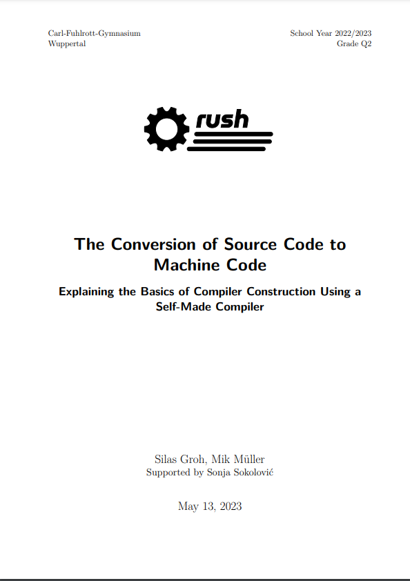

# Paper

This repository contains the LaTeX sources of the rush paper.

> Note: the current version of the paper is visible at [this deployment](https://paper.rush-lang.de)

## Building

- Clone the repository
- In the project directory, run `make init`
- Then, run `make build -j 1`

### Using docker

Alternatively, build the docker image of the `Dockerfile`, then run the
identical commands inside the Docker container

## Screenshot

